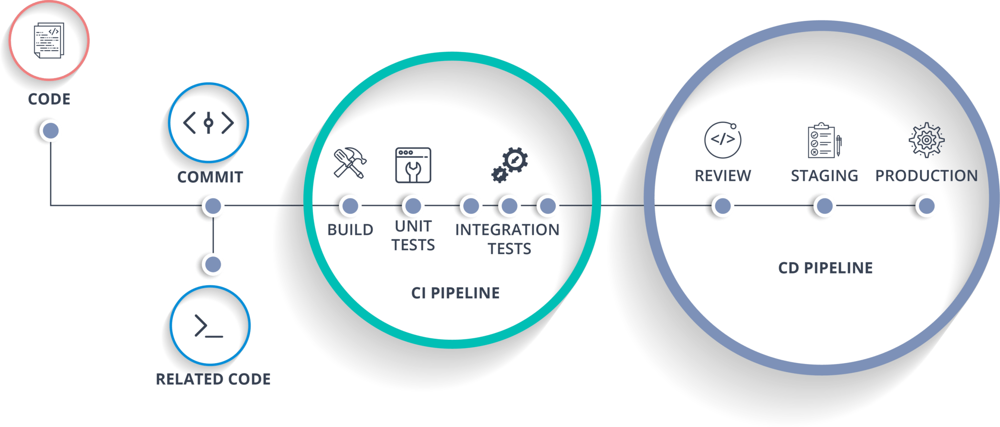

# server-deployment-practice

## Hassan Hamdan 

- Repository URL: https://github.com/HassanHamdanDev/server-deployment-practice
- Branch Name: dev

* Description :  *a web server using CI and CD and get used to the general process of building and deploying servers*

**PR : https://github.com/HassanHamdanDev/server-deployment-practice/pull/1**

* UML

